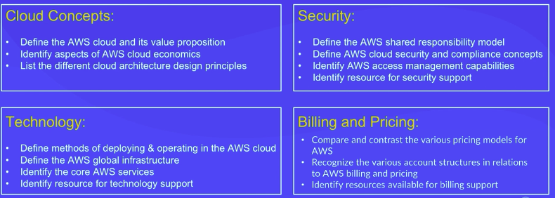

# AWS Cloud Practitioner

Additional Learning:
- [Skill builder](https://explore.skillbuilder.aws)

|Term |Definition|
|:---:|:--------:|
|AWS            |On demand delivery of IT resources and applications through the internet|
|Cloud computing|Collection of remote on-demand virtual resources offering compute, storage, database and network services that be can rapidly deployed at scale|
|Virtualization | Having multiple independent virtual machines running separate systems/applications, sharing underlying resources (through hypervisor) under 1 physical server|
|Public Cloud   | Consumer does not see hardware. Can specify geographical location of servers. Cloud vendor does maintenance|
|Private Cloud  | Infrastructure owned by consumer (on premise). Consumer does maintenance|
|Hybrid Cloud   | Mix between private and public cloud. Established when link occurs between private and public cloud. Usually short term (e.g for disaster recovery) |
|Lambda (Amazon)| Serverless compute, no need to provision hardware, or auto-scaling, ec2 instances |
|Monolithic     | Single component application|
|Microservices  | Decoupled component, allows scaling and development independent of other components|
|Policy (AWS IAM) | Is a collection of permissions |
|Subnet         | A collection of EC2 instances|
|NACLs| stateless|
|Recovery time objective (RTO)| The maximum acceptable amount of time it takes to get the system back online |
|Recovery Point Objective (RPO)| It is the acceptable amount of data loss measured in time|
|Elastic | The ability to scale computing resources up and down easily, with minimal friction|

## Amazon Kinesis Overview

Makes it easier to connect analyze and process data streams in real-time/near real-time.

It processes streams from both binary encoded data (audio and video) and base64 text-encoded data.

Auto-scaling is not automatic

Kinesis data stream is a set of shards which contains a sequence of data records.

The stream processing layer is managed by consumers, but once the data records are streamed, they can not be modified.

Data is stored for 24 hours by default.

Kinesis data stream is a stream storage layer.

## Pre-requisites

### Cloud Service Models - Core

The most common service models are as follows:
- Infrastructure as a Service
  - Architect your own portion of the cloud via configuring virtual cloud
  - Can determine OS installed and other config from operating system and upwards
- Platform as a Service
  - Have access to the framework and operating system upwards
  - Vendor looks after network, resources etc 
- Software as a Service
  - Application accessed over the internet (e.g gmail)

### Cloud Computing concepts:

1. On-demand resourcing
2. Scalability (Allows you to increase/decrease power or quantity with installation or physical processes provisioned)
3. Economy of Scale
4. Flexibility & Elasticity
5. Growth
6. Utility Based Metering
7. Shared Infrastructure
8. Highly Available
9. Security

### Cloud Compute core services:

- Compute
- Network
- Storage
- Database - Stores structured data in storage

[comment]: <> (### [Deployment models]&#40;https://docs.aws.amazon.com/en_us/sdk-for-net/v3/ndg/gs-cloud-deployment.html&#41;)
### Deployment models

- Full Cloud (all cloud)
- On premises (private cloud compromised of)
  - Compromised of location (at least 2 datacenter),
  - Physical security (external/internal)
  - Mechanical & electrical infrastructure
  - Network infrastructure (Architecture left to user)
  - Servers (dependant of user purpose of the server (some for processing power etc))
  - Storage
- Hybrid (part cloud, part local dc) : For GDPR reasons or learning curve reasons

## Module 1: Introduction to Amazon Web Services

Previously required people to maintain and setup data centers and architecture for different environments 
(hardware engineers, network engineer).

AWS (started in 2006), solution to offload the maintenance of datacenters, whilst maintaining control over pricing and
only using what you need.

### Amazon Services

Over 200+ services to use!

*Core Services*
- Compute 
- Networking and content delivery
- Storage - S3 typically 
- Database - 
- Security and Identity and compliance - Macie (Compliance checks), KMS, but each application/service has their own implementation as well as specific services for security (must whitelist the ports if external application is providing security)
- Management and governance

### Scale 

Can spin up and break down servers at a given moment cheaply due to economy of scale (DCs everywhere), in a PAYG model.
Allows deployment closer to user, hence lower latency, better output for customers.

## Module 2 Compute in the Cloud

### Why Cloud?

Cloud utilises virtualization. Virtualization allows:

- Reduced capital expenditure (less hardware)
- Reduced operating costs (less hardware, less space, cooling)
- Smaller footprint (above means less carbon footprint)

### [EC2 Instances](https://aws.amazon.com/ec2/?ec2-whats-new.sort-by=item.additionalFields.postDateTime&ec2-whats-new.sort-order=desc)

EC2 instances are virtual machines running in AWS Datacenters.
The volumes physically reside on the same host that provides your EC2 instance itself. It acts as local disc storage.

EC2 provides ephemeral storage (transient instead of persistent, good for temp file storage, cache, buffer, can but 
software on the instance based on this too, but not increase ephermal range, cam connect through pem or SSH)

EC2 has auto-scaling which uses a number of metrics to automatically add or remove servers from clusters

Horizontal scaling > Vertical scaling

**Pros**
- Read write speed better than average compared to alternative block storage
- Storage included in the price of the VM/server
- Self configured and self controlled (Linux, Windows script can run on first spin up of the server)

**Cons**
- Data within this instance will be removed if the instance is stopped or terminated. Not it if it rebooted.

Over 400+ different instances types and sizes to spin up [Click here to see](https://aws.amazon.com/ec2/instance-types/)!
Different EC2 instances have different use cases [stated here](https://aws.amazon.com/ec2/instance-types/).

Don't know what instance to choose? Or services? use [AWS Compute Optimizer](https://aws.amazon.com/compute-optimizer/). 
Uses ML to analyse previous use of workload and recommends services.

*Cost is **not** the same for all the regions* e.g Spot, most unreliably but cheapest (up for 6 hrs max)

Helpful web app to view price differences for EC2 per region etc [here](https://ec2types.io/home)

Different types of E2C instances are optimised for different purposes:
- General - Balance of compute memory and networking resources
- Memory - Ideal for high-performance databases
- Accelerated - Offers high-performances processors
- Storage - Suitable for data warehousing applications (data held for long time)

> When does the ec2 instance start charging? AMI Host script run

cj_at1

### AWS Shared Responsibility

- Security is a shared responsibility

**Customer Responsibility**

- Customer data, Platform, applications, Identity & Access Management, Operating System, Network & Firewall Configuration,
Client side data encryption, data integrity authentication, server side encryption, network traffic protection, origin server

**AWS Responsibility**

- AWS Foundation Services
  - Compute, Storage, Database, Network
- AWS Global Infrastructure
  - Regions, Availability Zones, Edge Locations

### Pricing

There are 4 different type of pricing commands:
- **On-Demand** - Consistent 
- **Spot** - If available can use it, up to 6 hours. Any workload that can be spun up when abruptly stopped
- **Reserved** - (discount on On-demand, require 1-3 year term commitment)
- **Compute Saving Plans** - (discount on On-Demand for consistent compute usage, require 1-3 year term commitment)

for ecample EC2 billing begin when the AMI boot sequence is initiated, ends with instance is terminated

### Dedicated computing

- Dedicated Instance : EC2 instance that runs in a VPC on hardware (taxi)
- Dedicate Host: Physical server with EC2 instance (personal car)

### Elasticity - Auto Scaling

- Auto Scaling
  - Launch/Tear down server when needed (auto-scaling/ workload increases)
  - Automatically adjusts the number of amazon EC2 instances to match demand
- Elastic Load balancer 
  - Distribute traffic to other servers depending on demand
  - Providing a single point of contact for traffic into the auto-scaling group

- core components: launch configuration, auto scale group, scaling plan

### AWS Messaging Service

**Simple Notification Service - NOTIFICATIONs**
- Create topic. Have publishers and subscribers to topic
- Push service - Messages automatically pushed to publishers. Limited retries. If publisher don't recieve it, message lost
- Use SNS with CloudWatch to send messages (Alarm) when threshold has been reached

**Simple Queue Service - QUEUING**
- Send, store and recieve messages (message stored for max 14 days) - default retention time 4 days
- Consumer looks to queue to pick up messages
- Polling service (pull service)
- Duplicated queues (distributed system) so messages can be extracted more than once
- Use in microservice structure for them to talk to each other

**AWS Lambda - serverless**
- Run code (functions) without provisioning or managing servers
- Pay only for compute time while code is running, how many times code is trigger
- Can have concurrent code running
- Use other AWS service to auto trigger code
- CON - timeout : 15 mins. If more than this, break function to smaller bits or use EC2
  - Can use AWS Step function to create state machine (to create workflow) to orchestrate lambda functions
- One API to one lambda function
- Do not keep environment variables inside a lambda function
- Lambda functions and event sources part of lambda applications

**AWS Simple Workflow Service**
- fully managed state tracker and task coordinator

**AWS Simple Email services**
- Ensure high delivery rates of emails

> reports metrics to where?
> Cloud trail

### Containers

One host with multiple containers
Isolated processes running on a server

To orchestrate multiple containers use:
- Amazon ECS 
- Amazon EKS 
Can also install own kubernetes to deploy and manage by using EC2 and installing software

AWS Fargate
- Serverless compute engine for serverless container orchestration

## Module 3: Global Infrastructure and Reliability
Global infrastructure is composed of the following:

### Availability Zones (AZs)
  - Physical data centers of AWS : Contains cloud compute main services
  - Multiple datacenters can form a availability zone
  - Each AZ will have at least one other AZ
  - They are all connected through low latency links
  - Each AZ is isolated from each other
  - High available and resillency

### [Availablity Region](https://aws.amazon.com/about-aws/global-infrastructure/regions_az/)

- Every region act independently

It is best practice to launch multiple EC2 instances across different regions due to failure reasons (High availablity).
The main region picked should be done based on the following:
- Proximity to your customers
- Available services within a Region
- Compliance laws and legal regulations
- Pricing

Each region has many availablity zone (at least 1) **BUT** each availablity zone can only belong to one region

The key features of a region is given below:
- Edge Locations (Some Edge locations have a secondary cache, retrieve cache data from regional edge cachce)
  - Form CDN (used by Cloudfront and lambda edge to cache data)
- Regional Edge Caches (caches content closer to the user, retains data longer in regional edge cache than edge location)
- Has more 'Points of Presence'

>Cloudfront (origin) -> regional cache -> edge location -> customer

Each region has AWS Edge network locations, usually heavily used. These are Content Distribution Network **(CDN)** for the
whole world. This is done to deliver low latency, high throughput content to end users. This is done through
[AWS CloudFront](https://aws.amazon.com/cloudfront/features/?p=ugi&l=na&whats-new-cloudfront.sort-by=item.additionalFields.postDateTime&whats-new-cloudfront.sort-order=desc).
The data flow from customer to client service is as follows:
- EC2 instance(origin) --> Edge location (cache) --> customer

> Edge locations are **not** equal to availability zones. Availability zones have 200+ services whereas edge locations have few services
mainly for caching CloudFront data

### AWS Outposts

Extends AWS infrastructure and services to your on-premises data center (like having a starbucks on site!)
as it runs instead your datacenter, allowing a high level of control over data.

Can access amazon services through CLI, sdk, or through management console UI.

### AWS CloudSearch

managed search solution

### AWS Elastic Transcoder

- manages transcoding process for any device
- frequency accessed media is cache at the edge

### AWS Appstream

- Used to provide windows application through the cloud to end user without code modifications

### AWS Data pipeline

- reliable service to move data from compute to storage services
- on premise data source - on cloud data source
- can move db data using this (or any data)

### AWS CloudFormation

- Create a collection of related AWS resources and provision them in an orderly and predictable way. through json
- can manage any AWS application through json format (Customisable work)

## Module 4: Networking

### Amazon Virtual private Cloud
Private network inside software account.

One can launch servers inside VPC. There are two types of server groups (subnets) that can be created inside a VPC:
- Public subnet (Internet access)
  -  needs internet gateway to connect to internet and receive requests.
- Private subnet (No intranet example)
  - needs private internet gateway to connect over VPN to own data

AWS Direct connect : Establish a dedicated connection between on-premises data center and the VPC

Can use Lambda with VPC to restrict data from being public

### Firewall
Have to set up firewalls! 
Set up firewalls on subnet level via network access control list (network ACL) and on a 
EC2 level via security group.

**Subnet**:

By default, allows all traffic, stateless firewall. Put rules for inbound and outbound traffic.

**EC2**:

By default, outbound open, inbound blocked, all traffic, stateful firewall.
Rules for incoming reflect outbound traffics too and EC2 level (security group)

### Route 53

Maintains domain name systems (DNS) records and translates domain name to IP address (domain resolution).

Routes user to internet applications (return IP address of EC2 instance the application running on)

Client --> Route 53 --> Application load balancer

## Module 5: Storage and Databases

There are three types of storage in AWS:
- Block storage
- Object storage
- File storage

### Amazon Elastic Block Store - EBS

**Block storage**: EBS, single block read/write. Example, laptop memory
- EBS volume - persistent
- EBS ephemeral - transient
- EBS snapshots - incremental backup
- Store data in 1 availablility zone

Provides persistent independent storage for the EC2 instance. They can also be used to provide back up

Can provide backups (snapshots) of the EC2 volume. Snapshots are incremental.

CAP = High Reliability

Types:
- SSD :
  - Better for databases using transactional workloads, boot volumes for ec2 instances
- HDD :
  - Better for logging information, processing large data (dealing with data)

Security:
- Provides encryption, using AWS KMS.

**Cons**
- For very high durability and availability use S3, EFS
- Shouldn't be used for multi-instance storage

### Amazon S3

reference: https://aws.amazon.com/s3/pricing/

**Object storage: S3**, each object consists of data, metadata and a key. S3 not publicly accessibly (can expose).
No size limit for bucket (per file - 5T)
- S3 Standard - frequently accessed, minim stored in 3 availability zones
- S3 Standard-IA - infrequently accessed data, minim 3 zones, retrieval more expensive than normal
- S3 One Zone-IA - stores data in single availability zone (best keep easily regenerate data here)
- S3 Intelligent Tiering - Monitor how often data accessed. Dynamically move data depending on access
- S3 Glacier (Archive data, retrieval 3-5 hrs)
- S3 Glacier Deep Archive (Archive data, retrieval up to 12 hrs)

> Glacier retrieval limts and costs
- Glacier users can restore 10 GB of data for free every month

Object based storage system that is:
- Highly available
- Durable
- Cost-effective
- Widely accessible
- (Scalable)

Each object is referenced by unique url when stored (like nosql?)

Automatically stores and duplicates data across multiple avaialblity zones

**Cons**
- Smallest file size 0 bytes, largest 5 terabytes

### Amazon EFS - Elastic File Storage

**File storage**: EFS
- Stores data across multiple availability zones

- Supports multiple instance access
- files accessible to network resources

### Databases
Types: Relational (access through SQL, joins etc), non-relational

Amazon Relational Database Service (In private subnet)
Engines supported (6):
- Aurora 
  - Also has serverless option for potential non-relational db work
  - Natively relational
  - (keeps 6 copies of data, consistently being backed up, 3 times faster than MySQL, and 5 times faster than PostgresSQL)
- PostgreSQL
- MySQL
- Microsoft

### Amazon DynamoDB (for non-relational db)
- nosql db (key-value store)
- Used for ultra-high performances
- Serverless 
- Amazon prime day runs on this!
- Charged for the total amount of through put and the storage of your data (allocation read and write units)

**Pros**
- Fully managed
- Schemeless
- High available
- Fast

**Cons**
- Queries are less flexible than SQL
- Eventual consistency
- Throughput provisional (not automatically adjusted. preset)

Analyse and query data from across data warehouses? use Amazon Redshift

## Module 6: Security

Security is a shared responsibility!

Customer responsible for:
- Configuring security groups on amazon ec2 instances
- Patching software on amazon EC2 instances
- Permissions for Amazon S3 

### AWS disaster recovery

- Back up and restore (RTO long, Cost Low)
    - Backups are made, put on AWS storage service.
    - Uses the following to actually import into AWS:
      - Storage gateway
      - aws snowball
      - direct connect
      - VPN
      - Internet
    - 
- Pilot light recovery (RTO low, Cost Low)
  - A very small replica of only your business-critical systems is made and is always running in another region,
  in case of diversion to that region in case of a disaster
  - Mirroring data, template environment created
  - Use AMI to start instances
- Warm stand by (RTO Medium, Cost Medium)
  - All key services running. small version of production environment running.
  - Scale up when disaster happens in reroute. everything like what it was before
  - DNS records changed to redirect
- Multi-site (RTO fast, Cost High)
  - Duplicate everything (full scale)
  - DNS records changed to redirect

### IAM

IAM Role : Permissions, getting access key to allow code to speak to other AWS services.

Controls user permissions (and granular entitlements) with AWS services 

User permissions created. Can also be created on DB side or SSO.

IAM role is an identity that you can assume to gain temp access

Multi-factor authentication: provides extra layer of protection for AWS accounts

Defines what services can communicate with others

> When can you change the instance security on a server
Even after it has be spun up

### Identity fedretaion
Allows one to access and manage AWS resources even if i dont have user account in IAM

### AWS Organizations
- create hierarchy of roles and service control policies to control number of roles that can be granted. Main accounr called 
root, 
- A collection of accounts is what is organised 
- User, group and role is inside the account,

### AWS Artifact
- Access AWS compliance reports on-demand
- Review, accept and manage agreements with AWS

### Customer compliance center
Information you need to know to check AWS compliance

### AWS waf
- Create rules for firewall
- Relies on cloud front

### AWS shield 
- Protection against DDoS attacks in real time

### AWS Inspector
- Allows you to perform security assessment checks

### AWS CloudWatch
> What does it do?

Monitors AWS infrastructure
- Basic EC2 monitoring by default 
- 7 metrics 5 minutes freq
- 3 metrics 1 min freq
- States: OK, Alarm, insufficent data

Sends notification alarmas or automatically make changes to the resources im monitoring based on rules that i have defined

### AWS storage gateway

Connects on premises storage with aws storage

### AWS Cognito
> What does it do?

They support both authenticated and unauthenticated identities for application use (can use SSO, or facebook authentication alondside AWS for
authentication).
- Mobile device specific!

### AWS CloudTrail

Web service that records API calls made on your account and delivers log files to your amazon S3 bucket
every 5 minutes

### AWS RDS

Provides high availablity and failover support for DB instances using multi-AZ deployments.

Provides duplicate db instance in another AZ in the same region (high availability and high resiliency)
Here 

Amazon technology:
- Oracle
- ALL SQL forms (except below)
- MariaDB instances

SQL Server Mirroring
- SQL Server DB instances

AWS responsible for patching of RDS

### AWS
>>> Penetration testing is possible without AWS approval depending on service used

### AWS KMS

Used to store and generate encryption keys that can be used by other AWS services/applications such as CloudTrail (rather than
default S3 managed keys)

There are 4 main components:
- Customer master keys
- Data Encryption keys
- Key Policies
- Grants

> Pricing?

> Audit changes?

### Amazon GuardDuty

- Intelligent threat detection for AWS products and services

## Module 7: Monitoring and Analytics

### AWS CloudTrail event

- Used to record AWS API calls and other activities from AWS account
- Used to save recorded information to log files in S3 bucket (default encrption SSE-S3 applied)
- Keeps metrics of application in single dashboard
- Monitor your resource usages

### AWS Trusted Advisor
Inspects AWS config and gives real time recommendations based on best practices.
- Uses dashboard to inform: Performance, cost optimization, security, fault tolerance, service limit
- Checking for open access permissions

## Module 8: Pricing and Support

PAYG model, pricing different for each region

Pay less when you reserve and when you bulk buy

Pricing model for serverless different: pay for what you are using

Consolidated billing - combine usage across accounts to receive volume pricing discounts

Cost explorer - Visualise graphs of expenditure

AWS Budget - receive alerts when there service usage exceeds user defined limits

AWS TAM - only for enterprise, offers point of contact support

### Cost Management Services

1. Planning to migrate to AWS  (TCO Calculator):
   1. Can compare AWS Cloud with on-premises costs
      2. Report will include:
         1. On-premise estimates (server, network hardware. Power/cooling costs. Data center space. Cost of IT personnel)
   2. Good for those considering migrating to AWS
2. Check recent costs (The Billing Dashboard):
   1. Visualise graphs of expenditure (Spend by service and service by spend, spend summary graph)
3. Analyze long-term spending trends (Cost Explorer):
   1. Historic and forecast data 12 months in past/future
   2. Insightful recommendation on replacing On-demand resources with Reserve ones
4. Limit spending (AWS Budgets):
   1. Cost
   2. Usage
   3. Reseraved instance utlization
5. Simplify your bills (Consolidated billing):

### Customer Support Plans

Support Options:
1. Access online resources (Basic)
2. General guidance from AWS (Developer) (time: Monday-Friday 8am-6pm)
3. 24-hour technical support (Business)
4. Dedicated account managers and personalized consultation (Enterprise)

During support there are certain levels that can be stated when an issue occur (Guidance, System impaired, Production system down,
Business-critical system down).

## Module 9: Migration and Innovation

Cloud adoption framework: gives advice on migration. Based on 6 perspectives:
- Business
  1. Business
     1. Ensures IT aligns with business needs
  2. People
     1. Supports dev of org whilst change management strategy for cloud migration
  3. Governance
     1. similar as above
- Technical
  1. Platform 
     1. Patterns to implement cloud practices
  2. Security
     1. Ensure org meets security objectives
  3. Operations

### Migrating strategies

6 strategies
- Rehost: Move app from on premise to eC2
- Replatform: Tinker then move (shift notification service to SNS)
- Refactor/Re-architect: As name suggests
- Repurchase: Change licensing/pricing to move to cloud
- Retain: Do not migrate
- Retire: Tear down application (not used)

For migration, AWS can ship storage to help with the data process

**AWS Snow Family**

- AWS Snowcone:
  - small rugged, secure edge computing and data transfer
  - 8TB
  - Works with IoT sensors
- AWS Snowball devices:
  - Edge storage optimized, Edge Compute optimized
  - ~Petabyte data transport (80 TB hard drive capacity)
- AWS Snowmobile:
  - For crazy large amounts of data (a whole truck!)
  - 100 PB (Exabyte scale)
  - Whilst on site AWS will connect network from local netwrok to mobile
  - Data then gets sent to AWS where it is imported into amazon s3
  - Data encrypted with 256 bit encryption keys (KMS)

Serverless migration takes less time

### AWS Well-Architected Framework Pillars

- Cost optimization
  - Measure ROI
- Operational excellence
  - Prepare, operate, evolve
  - Annotate documentation
  - Make frequent small changes
  - Anticipate failure
  - Knowledge exchange
- Performance efficiency
  - Use Serverless architecture (cheaper)
- Reliability
  - Test
  - Monitoring
  - Scale horizontal to reduce failure
  - Auto-scaling for requirements
  - Automation used where possible
- Security
  - IAM
  - Data Protection
  - Enable traceability
  - Apply security at every level
  - Automation
  - Protect data in transit

## Module 10: AWS Certified Cloud Practitioner Basics

[Exam prep](https://aws.amazon.com/certification/certification-prep/)
[Free webinars and learning](https://pages.awscloud.com/traincert_alwayslearning_virtualevents.html)
[Practice Labs](https://wellarchitectedlabs.com/)
[Cloud practitioner AWS prep](https://aws.amazon.com/certification/certified-cloud-practitioner/)

Domains covered

- Cloud Concepts
- Security and Compliance
- Technology
- Billing and Pricing

Logistics
- 90 min exam
- Multi choice 
- No negative marking 
- Flag question for review 
- Unanswered questions are scored as incorrect

Strategies
- Read full question
- Predict answer before looking at options
- Don't skip questions
- Max mark 1000, pass 700

### Misc

Placement Groups must be in the same AZ zone

- [Protect sensitive data](https://aws.amazon.com/blogs/big-data/create-a-secure-data-lake-by-masking-encrypting-data-and-enabling-fine-grained-access-with-aws-lake-formation/)
-  [Data lakes](https://aws.amazon.com/blogs/big-data/create-a-secure-data-lake-by-masking-encrypting-data-and-enabling-fine-grained-access-with-aws-lake-formation/)