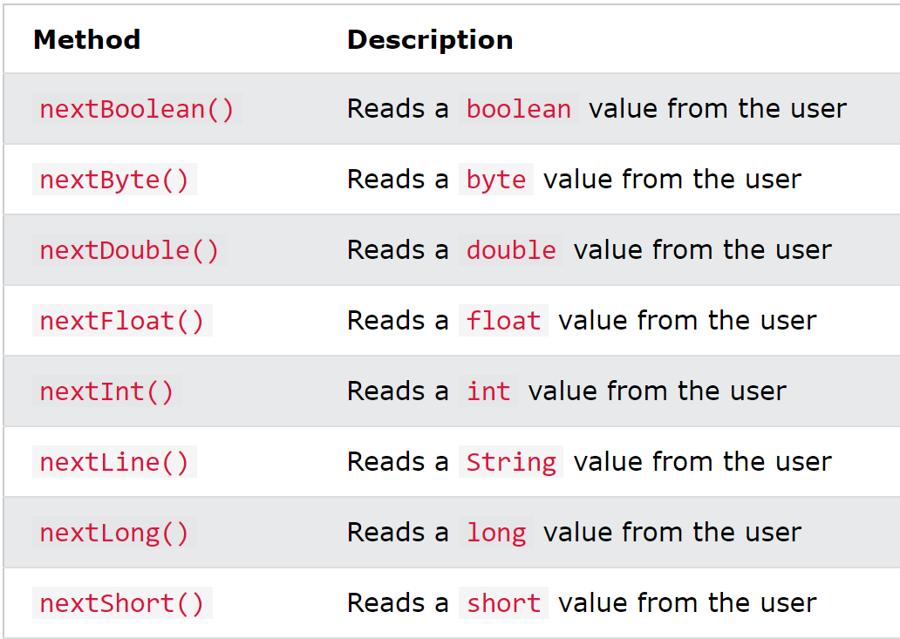

# Java

## Glossary

| Word | Definition|
|:----:|:---------:|

## Current Questions
- Why do we use octal, hexadecimal numbers?
- Why need escape sequence like \u?

## Data Types
When optimising code, one must always look towards the data that is being used and how it is being stored. The following
table shows a break-down of the primitive types and their storage:

| Type | Storage (bytes) | Range |
|:----:|:---------------:|:-----:|
| int  | 4 |~ -2 billion to +2 billion |
| short| 2 |~ -30 thousand to +30 thousand|
| long | 8 |~ -9 billion billion to +9 billion billion |
| byte | 1 | -128 to 127 |
| float| 4 |~ $-3 x 10^38$ to $+3 x 10^38$ |
|double| 8 |~ -$1.8 x 10^308$ to +$1.8x 10^308$ |
| char | | |
| boolean| | |

- Short and byte tend to be used for applications that are high performance or when storage space is limited.
- Can use underscores to represent long numbers (similar to python) `int earthHumanPopulation = 8_000_000_000`. The complier
will ignore underscore when rendering the variable.
- Java ensures range for each data type are constant so that programs will compile the same regardless of system.

> *NB: ensure that if you need precise numerical computations, use `BigDecimal` class.*

`BigDecimal` and `BigInteger` used to manipulate large numbers and precision arithmetic. 
### BigDecimal and BigInteger


## Operators

- `/` operator denotes integer division if both arguments integer, floating point otherwise. 
- Normally, all intermediate computations must be truncated (if not then output would be different dependant on underlying
processors)
- In order to ensure pre-truncated does not occur within method, use the `strictp` on method to use strict 
floating-point computation (might overflow so only use when needed)

## Conversion between numeric types

- byte --> short
- short --> int
- int --> long, double
- float --> double
- char --> int

if values are combined via +, -, x, /, then the operands (values either side of the operator) must be converted to the 
same type before calculations. If either double, long or float they will be converted to the respective type. Else int.

## Bitwise Operators

`^` == or

`~` == not

`>>` == shift bit pattern to the right

`<<` == shift bit pattern to the left

## Read input/output

Use scanner (defined in the java.util package) to read input values from console
`Scanner in = new Scanner(System.in)`.


Use scanner also to read from file input in the following way:
`Scanner in = new Scanner(Paths.get("myFile.txt")`

If you want to read sensitive data from the console you can use `Console` class introduced in java SE 6, which allows 
information like passwords to be hidden when input given:
`Console cons = System.Console()` with `cons.readLine("Read line: ");` and `cons.readPassword("Read password: ");` 
methods. 

`System.out.printf("%8.2f", x)` <-- field width 8 characters and precision 2 characters.


## Regex


## Control flow

statements/loops can be broken by using loop labels that are defined by:

```java
public class ReadData() {
    public void ReadData(int[] data) {
        read_data:
        while(true)
        {
            for(int i : data)
            {
                break read_data;
            }
        }      
    }
}
```

## Arrays

To copy an array use the following statement: `Arrays.copyOf(oldArray, lengthOfNewArray)`.

To sort an array use: `Arrays.sort(a)`. This uses quicksort algorithm.


## Comparator and comparable

Can compare data using class that implements either comparable or compartor interface. Preferable use comparable when 
dealing with most cases, and comparator when dealing with 

```java
public class BigDecimalComparator implements Comparable<BigDecimal> {
    @Override
    public int compareTo(BigDecimal otherBigDecimal) {
        return BigDecimal.compareTo(otherBigDecimal);
    }
}

public class Solutions {
    public static void main(String[] args) {
        Scanner in = new Scanner(System.in);
        ArrayList<String> inputString = new ArrayList();
        while (in.hasNextLine) {
            inputString.add(in.nextLine());
        }
        
        Collections.sort(inputString, BigDecimalComparator);
        
        
    }
}
```

## Data sets

|Data Type|Underlying Structure| Detail |
|:-------:|:------------------:|:------:|
|Hash Sets | Arrays of linked lists | Each list is called a bucket, modulo hashcode by buckets to find what bucket object placed in. If bucket already filled, then *hash collision* occurs. If hash table gets too full, *rehashing* needs to occur. This happens at a rate of load factor, where if percentage is reached, table of double the size is created | 
|Tree Sets | Red-Black Tree | Elements in this set must implement comparable/comparator|
|Queues/Deques | LinkedList and ArrayDeque | |
|Priority Queues | Heap | Self organizing binary tree, Elements in this set must implement comparable/comparator |
|TreeMap/HashMap | organises keys/hashes key| Same as sets but with keys representing where objects should be stored |
 
## Collections

- USE collections instead of concrete implementations (part of OOO principles), so code to interface!!
- Unmodifiable views of collections allow a collection to detect whether it is being modified at runtime, if so an 
exception is thrown and collection reminds untouched. Can be accessed through the following: `Collections.unmodifiable...`
\+ COLLECTION_TYPE (e.g List, Set etc)
- It it possible to set up a collection with more than one type of element within the list! To stop this from happening, 
one can use `Collections.checkedList(..)`, which will throw error at runtime when trying to add different type.

## Concurrency

Multi-tasking describes an operating system's ability to have more than one program running seemingly at the same time. 
Multi-threading is similar but at a program level, where a program will seemingly do multiple tasks at the same
time. The tasks are usually created on one thread. More than one task on a thread is called multi-threaded.

Processes are different to threads because processes run on a complete set of their own variables, threads share the 
same data.

### Threads

####States
To get the current state used the `Thread.getState`.

Threads can exist in one of the following 6 states:
- New: The thread has started but code has not been executed yet
- Runnable : When new thread has started, it is in the runnable state automatically. Code could be running or not. 
Java decides to run threads using scheduling depending on services available. It gives a set amount of time for each task
to run, after this time, system chooses next thread to give resources to to execute. Next choice of thread depends on 
thread priorities.
- Blocked : When thread in this state, it is temporarily inactive. This can happen when it is trying to obtain a lock 
from another thread.
- Waiting : When thread in this state, it is temporarily inactive. Happens when a thread is waiting on the thread scheduler
to get information on the state of another thread. Not much different between this and blocked.
- Timed waiting : Methods can have timeout periods where the thread is waiting for a period of time
- Terminated : When the run method exits naturally. Calling `.stop` or `.suspend` is currently deprecated.

####Properties
- By default, in java, all threads have a priority. 
- Default priority is given depending on the thread that created the thread.
- `MIN_PRIORITY =  1` and `MAX_PRIORITY = 10`. Theses levels are system dependant, where thread priorities given are 
mapped to the priority levels of the host platform. E.g. Windows has seven priority levels, Oracle JVM for linux has none!
- DD NOT STRUCTURE PROGRAMS SO THAT THEY DEPEND ON THREAD PRIORITY BECAUSE THEY CHANGE DEPENDING ON THE SYSTEM ITS DEPLOYED
ON!

####Daemon Threads
- Threads that serve others e.g timer thread that sends ticks to other friends
- If program only has daemon threads, virtual machine exits
- Should not be used to access persistent source like file or database

####Handlers
- Threads do not catch exceptions
- Exceptions thrown must be thrown using a handler that can be installed on a thread. The handler class must extend from 
`Thread.UncaughtExceptionHandler` interface.
- If default handler not installed for individual thread then it's null.
- If handler not installed for thread, then default `ThreadGroup` object used.
- Recommended not to use thread groups, where thread groups are ....


### Misc
- Java has two main package management systems: Maven (mainly used), Gradle (new and upcoming)