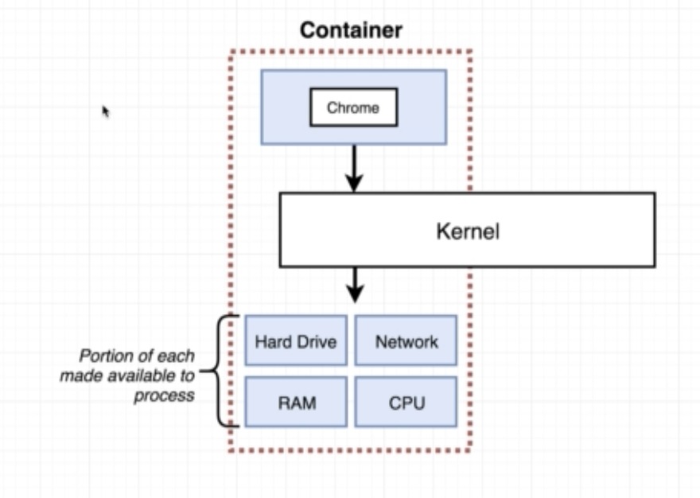

# Docker

## Why Docker?

Docker was created to solve installation problems on any computer. This means one does not have to worry about setup or program dependencies when install programs
Docker runs on Linux environment.

## Glossary

| Term|Definition|
|:---:|:--------:|
|Namescaping (Linux)|Portioning a section of the hard drive for certain process/es|
|Control Group (Linux) | Determining how much resources is used for a given process|
|Docker image| A file system snapshot|
|Docker CLI| A client that communicates commands to Docker server|
|Docker Server| A server that is in charge of creating images and containers|
|Container| Specific grouping of resources.  |
|Kernel | A kernel is communicator level between processes (like programs) and hardware (CPU/DISK)|
|DockerFile| Configuration file for docker image|
|Docker Compose| Seperate CLI to start multiple containers, automates commands|
|Service| Another name given for container|

## What is Docker?

- Ecosystem that runs container

## How does Docker work?

- When you run a docker command (send command to Docker CLI, processes then send to server), it communicates with the Docker Hub and tells it to download an image
  (which is a file of dependancies and instructions to create a specific progam). This image is then downloaded onto local
pc. This image can be used to create the program it describes in a Docker container (which is an instance of the image, and a running version of the image program)
- When an image is created, it is composed of two things: *FS Snapshot* and *Startup Command*. When a container is created,
it takes the *FS Snapshot* and sections away a portion of the hard drive for the programs/processes needed (installs them). It then runs the startup
command, which starts the running of a new instance the programs/processes.

### Containers

- Create container `docker create <image>` and starting container `docker start <container id>` is different!
- `docker run` (shows logs from terminal as default) and `docker start` (doesn't show logs as default)
- When container exited, it can be run again by `docker start` command
- Can not overwrite default command if container is running with a command already.
- To stop a container can use `docker stop` or `docker kill`
  - `docker stop` gives system call `SIGTERM` which allows system some time before stopping the main process in the container. Good if clean up needed before process has stopped
  - `docker kill` gives system call `SIGKILL`, doesn't give any time. Terminates container immediately
  - If `docker stop` doesn't work within 10 seconds, automatic trigger of `docker kill` is executed.
  - Preferred: `docker stop`
- Two containers do not automatically shared their file system
- Containers do not by default have means to access external requests (e.g through web), but do have ports which are left open for the possibility.
This means one has to map external calls to ports within the container in order to interact with the application through local machine. This is specified at runtime
through the `-p` command

### CLI

- To execute many processes within the container other than primary, use `docker exec -it <container-id> <command>`. The
`-it` parameter allows interaction with the container through terminal
- When processes are running, there are three default channels that are attached to each process `STDIN`, `STDOUT`, `STDERR`.
They represent how information is given into and out of the system. the `-it` parameter on a command allows terminal to be attached
to the `STDOUT` channel of the process

### Dockerfile

- Base image has no processes, just bare operating system that one can build upon
- Each step creates temporary container from previous step image, executes commands, destroys container after taking
snapshot of FS and primary command to image, passing image to next step.
- When building an image from dockerfile, none of the files in your project are available unless specifically defined. Use `COPY` to move files over from local FS to container FS.
- Docker caches the STEPS that do not change if rebuilding a dockerfile to improve performance (skips them if nothing has changed)

Most commonly used dockerfile instructions:

|Instruction|Description|
|:---------:|:----------:|
|`FROM`| Usually used to describe what type of base image one wants to use|
|`RUN`| Execute command|
|`CMD`| Defining starting command|
|`COPY`| Move files from local FS (first arg) to container FS (second arg)|
|`WORKDIR`| Move execution relative to folder defined (will be automatically generated if non-existence)|
|`EXPOSE`| does nothing. But with AWS Elastic Beanstalk, maps expose value to server so traffic can enter container|
- There should be different Dockerfiles for different environments (as there are different app versions for dev vs prod)
- To optimise the image being built, use Multi-step Docker builds. Build folder will be created in the current directory

### Docker volume

- This is used to see the changes to the local file system, propagated to container.
- Map all folders in container to folder local (ensure that there are the same folders in local and container!)
- If there are no mirror of a file or folder in container to local, one must use the `-v` command *without* colon to tell docker
<strong>not</strong> to map this file/folder e.g. `-v app/node_modules`.

### Docker compose file

- Used to start up multiple containers
- services used instead of containers
- creates containers that can freely access each other and exchange information with each other without port declaration
between the containers
- Can also get containers to restart if they crash
  - Restart policies are: "no", always, on-failure, unless-stopped. Containers defaulted to "no". (Put no in quotes in yml)
- `context` 

### Running tests in a container

- To interact with tests, execute container in interactive mode and change default start up command
- can execute command in current container or create second service for testing only

## Continuous Integration and Deployment
- CI and CD used to build and test software before deploying on server
- Applications run differently in development and production using Docker
- In Dev Environment:
  - Web container contains: Dev Server, application files to send data to client
- In Prod Environment:
  - Web container contains: Prod Server, application files to send data to client. (Dev server drops as there is no need
for large processing power since changes to source file will not be needed).
- (For javascript only) Nginx is a lightweight server (good for production)

### Demo specific configuration
- Travis CI:
  - one of many continuous integration services. Free and open source to use

#### AWS
- AWS Elastic beanstalk
  - Server with load balancer for serving web applications
  - Client --> Load Balancer server --> VM running docker
  - Pros: Manages traffic by dynamically spawning/removing VMs depending on incoming traffic

- IAM
  - Manages permissions for external services connecting to app in AWS
  - Tip: Ensure you note down somewhere the access key and secret key when you generate them

- S3 (AWS):
  - Scalable storage in the Cloud
- AWS EB CLI
  - When you need to see logs on your local machine and can't be bothered to see them in GUI, use EB CLI
  - Must initiate it within the directory in which you want logs of.

## Docker for Machine Learning

- Tensorflow estimator
- AWS GLUE
- AWS Safe maker

## Tips

- Only copy files that are needed 
- Delete node_modules folder (or build folders for any language) locally before building Dockerfile as it is done when 
image is built and do not need to waste time copying it over from local

## Workflow

- Set working directory first
- Two paths you can take:
  - Copy over configuration files and folders for project
  - Install dependancies with these files
- Create

## Useful Docker Commands/Tags

|Command/Tag|Description|
|:---------:|:---------:|
|`docker system prune`| Removes all stopped containers on disk|
|`docker stop`| Stops container running process|
|`docker exec -it <container-id> <command>`|Run another process in container|
|`docker exec -it <container-id> sh`|Run shell in container|
|`CTRL + C/D`|Exit processes|
|`docker build -t <docker-id/project:version>.` (from folder with Dockerfile) |Build docker image|
|`docker build -f <filename> .` (from folder with Dockerfile) |Build docker image using specific file|
|`docker run -d <docker-id/project> <override default command OPTIONAL>` (from folder with Dockerfile) |Start docker image in the background|
|`docker run -it -p <local port>:<container port> <image id>` (from folder with Dockerfile) |Start docker image on given port and interact with it|
|`./`| Current working directory |
|`.`| Current directory|
|`-p <local machine port> : <container port>`| Maps ports on local machine to that of container |
|`docker-compose up -d`| Looks for docker-compose.yml file and runs config|
|`docker-compose up --build`| To build images within docker compose file if source code changes|
|`docker-compose down`| Stops all images created in the docker compose file|
|`-v /app/node_modules -v $(pwd):/app` (bash/gitbash only)| Map current direct to /app folder (similar to what is done in the port) |